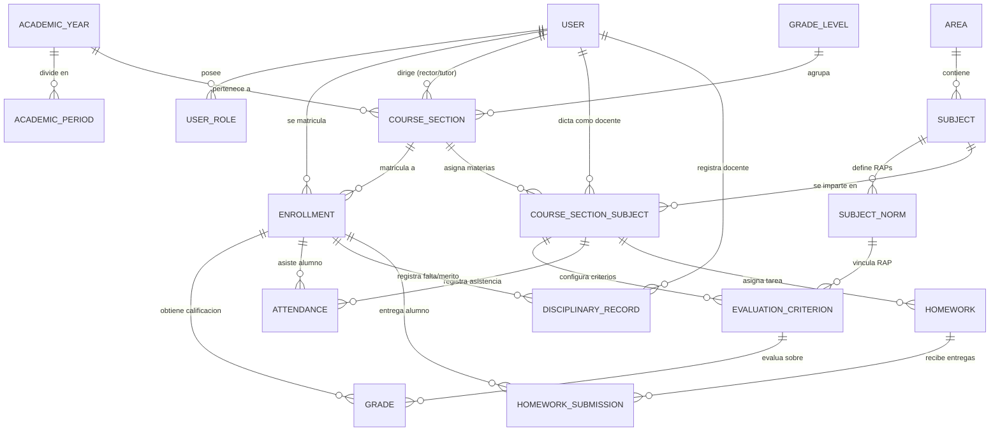
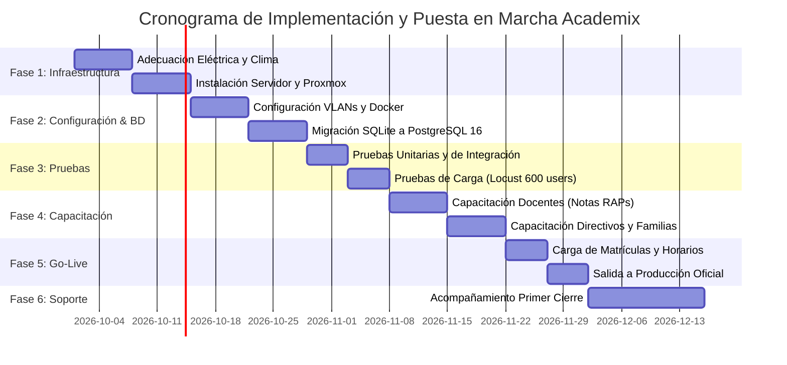

# DOCUMENTO TÉCNICO DE ARQUITECTURA TECNOLÓGICA Y DISEÑO DE ESTRUCTURA DE DATOS PARA LA PLATAFORMA DE GESTIÓN ESCOLAR ACADEMIX
## Propuesta Integral de Infraestructura On-Premise, Seguridad de la Información, Modelado Transaccional y Plan de Implementación

**Autores:** Equipo de Desarrollo de Software - Proyecto Academix  
**Programa de Formación:** Tecnología en Análisis y Desarrollo de Software (ADSO)  
**Ficha de Caracterización:** 2834512 / Fase de Diseño y Ejecución  
**Instructor Técnico:** Ingeniería de Sistemas e Informática SENA  
**Institución:** Servicio Nacional de Aprendizaje (SENA) - Centro de Formación en Tecnologías de la Información  
**Ciudad y Fecha:** Bogotá D.C., Colombia, 30 de septiembre de 2026  

---

## Tabla de Contenido
1. [Introducción y Contextualización del Sistema Academix](#1-introducción-y-contextualización-del-sistema-academix)
2. [Objetivos del Proyecto](#2-objetivos-del-proyecto)
   - 2.1. Objetivo General
   - 2.2. Objetivos Específicos
3. [Competencia 1: Arquitectura Tecnológica de la Infraestructura](#3-competencia-1-arquitectura-tecnológica-de-la-infraestructura)
   - 3.1. Análisis y Dimensionamiento de Necesidades de Infraestructura
   - 3.2. Inventario, Especificaciones Técnicas y Comparativa de Mercado
   - 3.3. Diagrama de Distribución Física, Lógica y Flujo de Red
   - 3.4. Estimación Presupuestal Detallada (CAPEX y OPEX en COP)
   - 3.5. Gestión de Riesgos, Seguridad Perimetral y Marco Legal Ley 1581
   - 3.6. Requerimiento Formal de Infraestructura Dirigido al Cliente
4. [Competencia 2: Diseño de la Estructura de Datos y Plan de Implementación](#4-competencia-2-diseño-de-la-estructura-de-datos-y-plan-de-implementación)
   - 4.1. Modelo Conceptual de Datos del Dominio Academix
   - 4.2. Modelo Lógico, Físico y Normalización en Tercera Forma Normal (3FN)
   - 4.3. Diccionario de Datos del Sistema Transaccional
   - 4.4. Estándares Aplicados, Integridad Referencial e ISO/IEC 25010
   - 4.5. Estrategia de Migración (SQLite a PostgreSQL) y Políticas de Respaldo
   - 4.6. Plan de Implementación, Cronograma Gantt y Protocolo de Pruebas
5. [Conclusiones](#5-conclusiones)
6. [Recomendaciones Técnicas](#6-recomendaciones-técnicas)
7. [Referencias Bibliográficas (Norma APA 7.ª Edición)](#7-referencias-bibliográficas-norma-apa-7ª-edición)
8. [Anexo: Lista de Chequeo Previa a la Entrega para el Aprendiz SENA](#anexo-lista-de-chequeo-previa-a-la-entrega-para-el-aprendiz-sena)

---

## Resumen Ejecutivo
El presente informe técnico describe la arquitectura de infraestructura tecnológica y el diseño de la estructura de datos para el sistema de información **Academix**, una plataforma integral de gestión escolar (School Management System / Learning Management System) concebida para modernizar la administración pedagógica y disciplinaria en instituciones de educación básica y media en Colombia. La arquitectura de hardware y red adopta un modelo On-Premise robusto, gobernado por un hipervisor de grado empresarial (Proxmox VE), contenedores Docker orquestados, terminación segura SSL con Nginx, caché en memoria con Redis y un motor de base de datos relacional PostgreSQL 16. La solución garantiza alta disponibilidad, aislamiento de tráfico mediante redes virtuales (VLANs), respaldo inmutable bajo la regla 3-2-1 y estricto cumplimiento del régimen de protección de datos personales de menores de edad estipulado en la Ley Estatutaria 1581 de 2012. Paralelamente, el modelado transaccional resuelve la jerarquía pedagógica multinivel (Área, Asignatura, Competencias y RAPs) y establece un plan integral de implementación con cronograma detallado, protocolo de pruebas de carga y matrices de capacitación.

---

# 1. Introducción y Contextualización del Sistema Academix

En el contexto actual de la educación básica y media en Colombia, las instituciones enfrentan el desafío de transitar desde modelos de gestión fragmentados —frecuentemente soportados en hojas de cálculo aisladas y expedientes físicos en papel— hacia ecosistemas digitales unificados capaces de centralizar la trazabilidad académica, el seguimiento formativo continuo y la convivencia escolar. De acuerdo con directrices del Ministerio de Educación Nacional (MEN) y los requerimientos formativos del Servicio Nacional de Aprendizaje (SENA), los sistemas de información institucionales deben articular de manera coherente la gestión directiva, la planeación curricular docente, la interacción con las familias y la salvaguarda de la información sensible.

La plataforma Academix responde a esta necesidad mediante una arquitectura modular en Python 3.12 y Django 5.x, estructurada en micro-aplicaciones internas desacopladas (apps: subjects, grades, courses, teachers, attendance, discipline, homework, reports y accounts). Su diseño contempla una experiencia de usuario orientada a la usabilidad pedagógica, integrando un sistema de control de acceso basado en roles (RBAC) con cinco perfiles fundamentales: Rector/Administrador, Coordinador Académico, Docente, Estudiante y Acudiente. Destaca en su núcleo la implementación de la jerarquía curricular contemporánea solicitada por las instituciones educativas modernas: Área de Conocimiento → Materia/Asignatura → Marco de Competencias e Indicadores → Resultados de Aprendizaje Previsto (RAPs), evaluados en una escala cuantitativa de 1.0 a 5.0 con distribución ponderada automática al 100.00%.

Para responder a las limitaciones de conectividad exterior de diversas regiones del país y asegurar la soberanía de los datos institucionales, el colegio ha optado por un modelo de infraestructura On-Premise en sus instalaciones centrales. Este documento formaliza las dos competencias clave del ciclo de formación en Análisis y Desarrollo de Software: primero, el diseño de la arquitectura tecnológica física, lógica y financiera; segundo, el diseño formal de la estructura de datos, aseguramiento de calidad según la norma ISO/IEC 25010 y el plan de implementación operativo.

---

# 2. Objetivos del Proyecto

## 2.1. Objetivo General
Diseñar la arquitectura tecnológica de infraestructura y la estructura relacional de datos para la plataforma de gestión escolar Academix, asegurando interoperabilidad, seguridad perimetral, alta concurrencia y normalización técnica según las normas vigentes y los requerimientos específicos de la institución educativa beneficiaria.

## 2.2. Objetivos Específicos
1. Dimensionar los recursos de hardware, almacenamiento, red y virtualización requeridos para soportar la concurrencia máxima del colegio a un horizonte de tres años, sustentando técnicamente la elección de componentes frente a alternativas comerciales.
2. Formular la topología de red física y lógica mediante segmentación de VLANs, esquemas de seguridad perimetral (firewall, VPN, SSL/TLS) y el protocolo de cumplimiento de la Ley 1581 de 2012 para protección de datos de menores.
3. Estructurar el presupuesto financiero de adquisición (CAPEX) y operación anual (OPEX) en pesos colombianos (COP), acompañado del requerimiento formal de adecuación física y eléctrica al cliente.
4. Modelar la base de datos relacional transaccional en Tercera Forma Normal (3FN), garantizando integridad referencial y documentando el catálogo de entidades mediante diagrama entidad-relación y diccionario de datos técnico.
5. Definir la estrategia de migración desde el entorno de desarrollo hacia PostgreSQL 16 y estructurar el plan de implementación integral, incluyendo cronograma tipo Gantt, protocolos de pruebas de carga y matrices de capacitación por rol.

---

# 3. Competencia 1: Arquitectura Tecnológica de la Infraestructura

## 3.1. Análisis y Dimensionamiento de Necesidades de Infraestructura
El dimensionamiento de infraestructura de Academix parte de la caracterización demográfica de una institución educativa de educación básica y media con capacidad para 1,200 estudiantes matriculados, 60 docentes de tiempo completo, 10 directivos y administrativos, y aproximadamente 1,800 acudientes registrados. Para evitar cuellos de botella y sobrecostos por sobreaprovisionamiento, se definieron escenarios de carga basados en perfiles de concurrencia y estacionalidad académica.

### Tabla 1
*Perfil de Usuarios y Estimación de Concurrencia Simultánea en Academix*

| Rol de Usuario | Población Total | Concurrencia Pico (%) | Usuarios Concurrentes | Tipo de Operación Predominante |
| :--- | :---: | :---: | :---: | :--- |
| **Estudiantes** | 1,200 | 25 % | 300 | Lectura (consultas de notas, descarga tareas, foros) |
| **Docentes** | 60 | 90 % | 54 | Escritura/Lectura (calificación RAPs, asistencia, observador) |
| **Directivos / Coordinadores** | 10 | 100 % | 10 | Operaciones analíticas, emisión boletines, auditoría |
| **Acudientes / Padres** | 1,800 | 8 % | 144 | Lectura esporádica (boletines, novedades disciplinarias) |
| **Total Sistema Pico** | **3,070** | **-** | **508 concurrentes** | **Carga mixta en periodos de cierre de calificaciones** |

*Nota.* Datos simulados con base en el calendario académico institucional. El pico máximo de 508 usuarios concurrentes ocurre durante las semanas de cierre de periodo y entrega de boletines trimestrales.

### Supuestos de Cómputo, Almacenamiento y Ancho de Banda
- **Demanda de Memoria RAM:** Se calcula mediante la ecuación $RAM = OS_{Base} + (N_{workers} \times RAM_{worker}) + DB_{SharedBuffers} + Redis_{Cache}$. Asignando 4 GB para el sistema operativo host e hipervisor, 8 workers Gunicorn (con un consumo promedio de 180 MB por proceso bajo carga: 1.44 GB), un buffer pool de PostgreSQL de 8 GB para mantener en memoria las tablas de calificaciones y asistencias más consultadas, y 2 GB para Redis, se establece una base operativa mínima de 16 GB, proyectando 32 GB como valor óptimo de despliegue para absorber ráfagas.
- **Almacenamiento y Crecimiento a 3 Años:** Cada estudiante genera anualmente registros en notas, asistencias, observador y evidencias digitales. Se estima que la base de datos relacional crecerá a una tasa de 4.8 GB por año lectivo (aproximadamente 14.4 GB en 3 años). Los archivos estáticos y multimedia de tareas escolares (PDFs, imágenes de evidencias y trabajos de estudiantes) se dimensionan con una cuota máxima de 5 MB por entrega y 20 entregas anuales por estudiante, representando 120 GB anuales. Con un esquema de depuración y compresión a los dos años, el repositorio de objetos acumulará 360 GB en el trienio. Para alojar el sistema, base de datos, logs, snapshots del hipervisor y copias de seguridad locales, se establece un requerimiento de almacenamiento efectivo de 1.2 TB en arreglo redundante RAID 10.
- **Consumo de Ancho de Banda WAN/LAN:** En la red local (LAN), cada petición HTTP promedio de la interfaz Bootstrap 5 / Vanilla JS representa 120 KB tras la carga inicial de assets cacheados. Con 508 usuarios generando una petición cada 10 segundos, el flujo local alcanza 6.1 MB/s (aprox. 48.8 Mbps), soportado por el enlace Gigabit Ethernet troncal. Para el acceso externo de acudientes y docentes fuera del colegio, un enlace de fibra óptica simétrica dedicado de 100 Mbps garantiza un tiempo de respuesta inferior a 450 ms en el 95 % de las transacciones (percentil 95).

---

## 3.2. Inventario, Especificaciones Técnicas y Comparativa de Mercado

### Tabla 2
*Especificaciones Técnicas de Hardware y Software para la Infraestructura On-Premise*

| Componente | Especificación Mínima | Especificación Recomendada | Propósito en Academix |
| :--- | :--- | :--- | :--- |
| **Servidor Físico (Host)** | 1x Intel Xeon E-2324G (4C, 3.1 GHz), 16 GB DDR4 ECC | 1x AMD EPYC 7302P (16C/32T, 3.0 GHz) o Dual Xeon Silver, 64 GB DDR4 ECC Reg. | Servidor bare-metal de rack 2U para alojar hipervisor y VMs/contenedores |
| **Almacenamiento Principal** | 2x 1 TB SSD SATA Enterprise en RAID 1 software | 4x 960 GB SSD NVMe Enterprise en RAID 10 hardware (con caché BBU 2 GB) | Particiones OS, base de datos PostgreSQL, repositorio de medios y logs |
| **Interfaces de Red (NIC)** | 2x 1 GbE RJ45 integradas | 4x 1 GbE RJ45 + 2x 10 GbE SFP+ (LACP / 802.3ad agregación de enlaces) | Segmentación de red, VLANs independientes y enlace fuera de banda (IPMI/iDRAC) |
| **Switch Distribución L3** | Switch Gestionable L2 de 24 puertos Gigabit | Switch Gestionable L3 de 24 puertos 1GbE + 4 puertos 10G SFP+ (802.1Q VLANs) | Interconexión troncal de servidores, enlace con APs y enrutamiento inter-VLAN |
| **Firewall Perimetral** | Routerboard básico con reglas iptables | Appliance dedicado de seguridad (Netgate 4100 pfSense Plus / FortiGate 60F) | Filtrado de paquetes L3/L4/L7, VPN WireGuard, IDS/IPS (Suricata) y NAT |
| **Sistema de Energía (UPS)**| UPS Interactiva de 1,500 VA / 900 W | UPS Online Doble Conversión de 3,000 VA / 2,700 W con tarjeta SNMP | Protección eléctrica, cero tiempo de transferencia y autonomía de 35 min |

*Nota.* El dimensionamiento recomendado provee redundancia N+1 en almacenamiento (RAID 10) y fuentes de poder redundantes conmutables en caliente (Hot-Plug 550W Platinum).

### Tabla 3
*Matriz Comparativa entre Hipervisores de Virtualización: Proxmox VE frente a VMware ESXi*

| Criterio de Evaluación | Proxmox Virtual Environment (VE) 8.x | VMware ESXi / vSphere 8.x | Impacto y Decisión para Academix |
| :--- | :--- | :--- | :--- |
| **Licenciamiento y Costos** | Open-source bajo licencia GNU AGPLv3. Acceso total a funciones sin costo; suscripción comunitaria opcional. | Propietario con suscripción anual obligatoria por core tras adquisición Broadcom. Costos prohibitivos. | **FAVORABLE A PROXMOX.** Elimina costos recurrentes de licencias, orientando el presupuesto a hardware robusto. |
| **Soporte Contenedores** | Soporte nativo de contenedores Linux (LXC) y máquinas virtuales KVM en el mismo panel web. | Enfocado en VMs; soporte de contenedores requiere suites adicionales complejas (vSphere Tanzu). | **FAVORABLE A PROXMOX.** Despliega microservicios ligeros con sobrecarga de memoria casi nula frente a VMs. |
| **Gestión Almacenamiento**| Soporte nativo avanzado con ZFS, Btrfs, LVM-Thin, snapshots inmutables y deduplicación. | Sistema de archivos VMFS propietario. Capacidades avanzadas requieren almacenamiento SAN/NAS o licencias vSAN. | **FAVORABLE A PROXMOX.** ZFS permite replicación asíncrona local y compresión transparente sin costo extra. |
| **Respaldo y Recuperación**| Herramienta Proxmox Backup Server integrada con deduplicación en cliente y cifrado nativo. | Requiere integración con soluciones de terceros (Veeam, Commvault) con costos añadidos por socket o VM. | **FAVORABLE A PROXMOX.** Garantiza la política de respaldo 3-2-1 sin software comercial externo. |
| **Facilidad de Operación** | Panel web HTML5 intuitivo, sin agentes pesados, con consola VNC/SPICE y API REST completa. | Panel vSphere Client completo pero con dependencia de componentes vCenter para gestión centralizada. | **NEUTRAL.** Ambos paneles son profesionales; la base Debian de Proxmox es ideal para el equipo de TI escolar. |
| **Veredicto de Selección** | **SELECCIONADO:** Máxima soberanía tecnológica, mínimo TCO y flexibilidad de contenedores. | **DESCARTADO:** Prohibitivo financieramente para la institución debido a licenciamiento por suscripción. | Adopción de Proxmox VE 8.2 como hipervisor bare-metal definitivo. |

---

## 3.3. Diagrama de Distribución Física, Lógica y Flujo de Red

### Figura 1
*Diagrama de Despliegue Físico, Topología de Red y Segmentación de VLANs*

```
+-----------------------------------------------------------------------------------------------+
|                                      ZONA EXTERIOR (WAN)                                      |
|                       Fibra Óptica Simétrica Dedicada (100 Mbps)                              |
+----------------------------------------------+------------------------------------------------+
                                               |
                                               v
+-----------------------------------------------------------------------------------------------+
| APPLIANCE DE SEGURIDAD PERIMETRAL (pfSense / FortiGate)                                       |
| - NAT 1:1 / Port Forwarding Seguro (443 -> Reverse Proxy)                                     |
| - VPN Gateway (WireGuard / IPsec para acceso docente y administrativo remoto)                 |
| - IDS/IPS (Suricata / Snort) con bloqueo automatizado de fuerza bruta                         |
+----------------------------------------------+------------------------------------------------+
                                               | Troncal 802.1Q (LACP 2 Gbps)
                                               v
+-----------------------------------------------------------------------------------------------+
| SWITCH PRINCIPAL DISTRIBUCIÓN L3 (Ubiquiti UniFi Pro / Cisco Catalyst 24G)                   |
|  [VLAN 10: Gestión]      [VLAN 20: Servidores]   [VLAN 30: Admin]   [VLAN 40: Profes]   [VLAN 50: WiFi] |
|   192.168.10.0/24         192.168.20.0/24         192.168.30.0/24    192.168.40.0/24    192.168.50.0/22 |
|   (IPMI, Switches, PDU)   (Host Proxmox, VMs)    (Rectoría, Secre)  (Salas Docentes)   (Estudiantes)   |
+----------------------------------------------+------------------------------------------------+
                                               |
                                               v
+-----------------------------------------------------------------------------------------------+
| SERVIDOR FÍSICO HOST (Proxmox VE 8.x Bare-Metal)                                              |
| Redundancia: RAID 10 NVMe Enterprise | Dual PSU 550W | Conectado a UPS Online 3000VA          |
|                                                                                               |
| +-------------------------------------------------------------------------------------------+ |
| | VM 100: ACADEMIX CORE PRODUCTION (Ubuntu Server 24.04 LTS / Docker Engine)                | |
| |   +-----------------------+     +-----------------------+     +-------------------------+ | |
| |   |  NGINX Reverse Proxy  | --> | GUNICORN WSGI Workers | --> |  DJANGO 5.x FRAMEWORK   | | |
| |   |  (SSL/TLS Let's Enc.) |     | (Python 3.12, 8 wks)  |     |  (Lógica de Negocio)    | | |
| |   +-----------------------+     +-----------------------+     +------------+------------+ | |
| |                                                                            |              | |
| |                                  +-----------------------------------------+              | |
| |                                  v                                         v              | |
| |                     +-------------------------+               +-------------------------+ | |
| |                     |   POSTGRESQL 16 MOTOR   |               |   REDIS 7 CACHÉ / OPS   | | |
| |                     |   (Base Datos 3FN / NVMe|               |   (Sesiones, Colas Celery| |
| |                     +-------------------------+               +-------------------------+ | |
| +-------------------------------------------------------------------------------------------+ |
|                                                                                               |
| +-----------------------------------------+   +---------------------------------------------+ |
| | VM 200: MONITORING & AUDITORÍA          |   | CONTENEDOR PBS: RESPALDOS LOCALES           | |
| | Prometheus + Grafana + Node Exporter    |   | Proxmox Backup Server (Deduplicación/ZFS)   | |
| +-----------------------------------------+   +---------------------------------------------+ |
+-----------------------------------------------------------------------------------------------+
```

*Nota.* Arquitectura de distribución física y virtualizada elaborada conforme al estándar IEEE 802.1Q para aislamiento de tráfico y ANSI/TIA-568-D para infraestructura de telecomunicaciones.

---

## 3.4. Estimación Presupuestal Detallada (CAPEX y OPEX en COP)

### Tabla 4
*Presupuesto de Inversión Inicial en Activos de Capital (CAPEX)*

| Ítem / Componente | Descripción y Marca / Modelo | Cantidad | Valor Unitario (COP) | Valor Total (COP) |
| :--- | :--- | :---: | :---: | :---: |
| **Servidor de Rack 2U** | Dell PowerEdge R7515 / AMD EPYC 7302P 16C, 64 GB RAM ECC, Dual PSU 550W | 1 | $ 18,500,000 | $ 18,500,000 |
| **Discos NVMe Enterprise** | Samsung PM9A3 960 GB NVMe PCIe 4.0 U.2 (Arreglo RAID 10 Hardware) | 4 | $ 1,250,000 | $ 5,000,000 |
| **Controlador RAID Hardware**| Dell PERC H755 con 8 GB caché NVRAM y batería BBU | 1 | $ 2,800,000 | $ 2,800,000 |
| **Switch Gestionable L3** | Ubiquiti UniFi Pro 24 PoE (USW-Pro-24-PoE) 24x 1GbE + 2x 10G SFP+ | 1 | $ 3,600,000 | $ 3,600,000 |
| **Firewall Perimetral** | Netgate 4100 Base con pfSense Plus integrado (Failover dual WAN) | 1 | $ 3,200,000 | $ 3,200,000 |
| **UPS Online Doble Conv.** | APC Smart-UPS On-Line SRT 3000VA / 2700W con tarjeta de red SNMP | 1 | $ 6,400,000 | $ 6,400,000 |
| **Gabinete Rack y PDU** | Rack cerrado 24U con ventilación termostática y PDU monitoreable | 1 | $ 2,100,000 | $ 2,100,000 |
| **Cableado y Puesta Marcha**| Cableado Cat6A LSZH, patch panels certificados, mano de obra y certificación Fluke | Global | $ 4,500,000 | $ 4,500,000 |
| **TOTAL CAPEX** | **Inversión inicial requerida para puesta en marcha** | - | - | **$ 46,100,000** |

*Nota.* Total CAPEX estimado: Cuarenta y seis millones cien mil pesos colombianos ($ 46,100,000 COP).

### Tabla 5
*Presupuesto Operativo Anual Proyectado (OPEX)*

| Concepto Operacional | Proveedor / Responsable | Frecuencia | Costo Mensual (COP) | Costo Anual (COP) |
| :--- | :--- | :---: | :---: | :---: |
| **Internet Fibra Simétrica 100 Mbps** | ISP Corporativo (Claro / Tigo / ETB Empresas) | Mensual | $ 450,000 | $ 5,400,000 |
| **Suscripción Soporte Proxmox** | Proxmox Community Subscription (1 CPU Socket) | Anual | $ 65,000 | $ 780,000 |
| **Almacenamiento Off-Site Respaldos**| B2 Cloud Storage / AWS S3 Glacier (500 GB cifrados) | Mensual | $ 45,000 | $ 540,000 |
| **Mantenimiento Preventivo Físico** | Proveedor Técnico Especializado (Limpieza y calibración UPS) | Semestral | $ 150,000 | $ 1,800,000 |
| **Bolsa de Soporte y Actualización**| Equipo de Desarrollo SENA / Técnico de Sistemas Institucional | Mensual | $ 300,000 | $ 3,600,000 |
| **TOTAL OPEX ANUAL** | **Costo de operación y sostenimiento anual de la plataforma** | - | **$ 1,010,000** | **$ 12,120,000** |

---

## 3.5. Gestión de Riesgos, Seguridad Perimetral y Marco Legal (Ley 1581 de 2012)

### Tabla 6
*Matriz de Riesgos Tecnológicos, Impacto y Medidas de Mitigación*

| Riesgo Identificado | Probabilidad | Impacto | Efecto Potencial | Estrategia de Mitigación Implementada |
| :--- | :---: | :---: | :--- | :--- |
| **Corte prolongado de energía** | Media | Alto | Apagado abrupto, corrupción de base de datos | UPS Online Doble Conversión 3 kVA con autonomía de 35 min y script de apagado ordenado apcupsd vía red. |
| **Fallo físico de disco** | Baja | Crítico | Pérdida de integridad de notas y expedientes | Arreglo RAID 10 hardware con soporte Hot-Spare; tolerancia a fallo simultáneo de hasta 2 discos en espejos distintos. |
| **Inyección SQL o XSS** | Media | Crítico | Exfiltración de datos, alteración de calificaciones | Uso obligatorio del ORM parametrizado de Django 5.x; sanitización automática de templates; cabeceras CSP, HSTS y X-Frame-Options. |
| **Fuerza bruta a credenciales** | Alta | Medio | Compromiso de cuentas docentes o directivas | Módulo django-axes con bloqueo de IP tras 5 intentos fallidos por 30 minutos; políticas de contraseñas seguras y captcha. |
| **Fuga de datos de menores** | Baja | Catastrófico | Sanciones legales de la SIC, vulneración derechos | Cifrado en reposo (LUKS en particiones de BD) y en tránsito (TLS 1.3 con certificados HSTS); RBAC estricto. |

### Protección de Datos de Menores de Edad (Ley 1581 de 2012 y Decreto 1377 de 2013)
1. **Consentimiento Informado:** En concordancia con el Artículo 7 de la Ley 1581 de 2012 y el Artículo 12 del Decreto 1377 de 2013, los datos de los estudiantes solo se tratan respondiendo a su interés superior y asegurando sus derechos fundamentales. En la matrícula virtual, el acudiente suscribe digitalmente el consentimiento informado.
2. **Aislamiento de Datos Sensibles del Observador:** Los registros disciplinarios de situaciones tipo I, II y III (Ley 1620 de 2013) poseen cifrado y visibilidad restringida exclusivamente al Rector, Coordinador y Director de Grupo asignado.
3. **Pistas de Auditoría Inmutables:** Triggers automáticos en PostgreSQL registran usuario, IP, marca temporal y valores anteriores ante cualquier modificación de notas o consulta de expedientes.

---

## 3.6. Requerimiento Formal de Infraestructura Dirigido al Cliente

> ### CARTA FORMAL DE REQUERIMIENTO AL CLIENTE
> **Fecha:** 30 de septiembre de 2026  
> **Para:** Consejo Directivo y Rectoría Institucional  
> **De:** Equipo de Arquitectura de Software - Proyecto Academix (SENA ADSO)  
> **Asunto:** Requisitos indispensables de adecuación física, eléctrica, de conectividad y gestión para el despliegue del servidor central  
> 
> Estimados directivos:  
> Con el propósito de garantizar la óptima instalación, estabilidad operativa y longevidad de la plataforma Academix, nos permitimos formalizar el pliego de requerimientos que la institución educativa debe proveer y certificar de manera previa al ingreso del equipamiento de cómputo:
> 
> 1. **Espacio Físico (Cuarto de Servidores / Rack):**
>    - Área designada de mínimo 2.5 m × 2.0 m, de acceso restringido con cerradura biométrica o llave controlada.
>    - Climatización y aire acondicionado configurado a temperatura constante de 20 °C ± 2 °C y humedad relativa entre 40 % y 60 %.
>    - Piso seco, libre de riesgo de inundación o filtraciones hidrosanitarias, sin ventanas exteriores directas.
> 
> 2. **Acometida Eléctrica y Puesta a Tierra:**
>    - Circuito eléctrico regulado e independiente de 120V / 20A con cable calibre AWG 12 THHN, exclusivo para el rack de comunicaciones.
>    - Sistema de puesta a tierra certificado bajo norma RETIE con resistencia de dispersión inferior a 5 Ohmios.
>    - Tomas dobles polarizadas grado comercial de alta resistencia (NEMA 5-20R) conectadas a la salida de la UPS.
> 
> 3. **Conectividad y Enlace WAN:**
>    - Contratación activa de enlace simétrico de fibra óptica empresarial con al menos una dirección IP pública fija estática para enrutamiento del dominio escolar.
>    - Punto de red Gigabit Cat6A certificado desde el switch central hasta la ubicación del rack del servidor.
> 
> 4. **Acompañamiento Institucional y Cronograma:**
>    - Designación formal de un enlace técnico (responsable de sistemas o infraestructura) que acompañará las jornadas de instalación.
>    - Autorización escrita de ventanas de mantenimiento los fines de semana previos al inicio del año lectivo para pruebas de penetración y carga eléctrica.

---

# 4. Competencia 2: Diseño de la Estructura de Datos y Plan de Implementación

## 4.1. Modelo Conceptual de Datos del Dominio Academix
El modelo conceptual organiza las entidades en cuatro subsistemas:
1. **Subsistema Académico-Curricular:** Área de Conocimiento → Materia/Asignatura → Competencias e Indicadores → Resultados de Aprendizaje Previsto (RAPs: Saber, Hacer, Ser y Elaborar).
2. **Subsistema de Oferta y Cursos:** Año Lectivo, Periodos Académicos, Grados Escolares (1° a 11°) y Aulas/Secciones (10°A, 11°B), a las que se vinculan Estudiantes y Docentes.
3. **Subsistema Transaccional de Evaluación y Asistencia:** Criterios de Evaluación ponderados automáticamente al 100 %, Calificaciones numéricas de 1.0 a 5.0 registradas por RAP, y Asistencias por sesión.
4. **Subsistema de Convivencia y Tareas:** Tareas escolares con entregas digitales, y el Observador del Estudiante con tipificación de faltas y firmas de compromisos.

## 4.2. Modelo Lógico, Físico y Normalización en Tercera Forma Normal (3FN)
- **1FN:** Se eliminaron grupos repetitivos. Las calificaciones y asistencias se almacenan como tuplas atómicas independientes.
- **2FN:** Los atributos de tablas con claves compuestas dependen de la totalidad de la clave y no de partes de ella.
- **3FN:** Se eliminaron dependencias transitivas; los datos del Área de Conocimiento residen en la entidad `Area`, y `Subject` solo guarda la clave foránea `area_id`.

### Figura 2
*Diagrama Entidad-Relación Lógico en Notación Mermaid (`erDiagram`)*



---

## 4.3. Diccionario de Datos del Sistema Transaccional

### Tabla 7
*Diccionario de Datos: Tabla 'subjects_subjectnorm' (Resultados de Aprendizaje Previsto - RAPs)*

| Nombre del Campo | Tipo PostgreSQL | Nulo / Default | Clave / Restricción | Descripción y Regla de Negocio |
| :--- | :--- | :--- | :--- | :--- |
| `id` | `BIGSERIAL` | NOT NULL | PK | Identificador único secuencial autonumérico |
| `subject_id` | `BIGINT` | NOT NULL | FK -> `subjects_subject(id)` | Asignatura a la que pertenece el RAP pedagógico (ON DELETE CASCADE) |
| `code` | `VARCHAR(30)` | NOT NULL | UNIQUE(`subject_id`, `code`) | Código de identificación institucional del RAP (ej. RAP-MAT-01) |
| `title` | `VARCHAR(255)` | NOT NULL | CHECK (length > 3) | Enunciado resumen del resultado de aprendizaje |
| `competency` | `TEXT` | NOT NULL | - | Competencia marco del área a la que tributa el RAP |
| `domain` | `VARCHAR(120)` | DEFAULT 'Cognitivo' | - | Dominio pedagógico: Cognitivo, Práctico o Socioafectivo |
| `saber` | `TEXT` | NOT NULL | - | Dimensión cognitiva: Conceptos, principios y teorías a asimilar |
| `hacer` | `TEXT` | NOT NULL | - | Dimensión procedimental: Habilidades prácticas y modelación |
| `evidence` | `TEXT` | NOT NULL | - | Evidencia de elaboración: Instrumento tangible de evaluación |

### Tabla 8
*Diccionario de Datos: Tabla 'grades_evaluationcriterion' (Criterios y Ponderación de RAPs)*

| Nombre del Campo | Tipo PostgreSQL | Nulo / Default | Clave / Restricción | Descripción y Regla de Negocio |
| :--- | :--- | :--- | :--- | :--- |
| `id` | `BIGSERIAL` | NOT NULL | PK | Identificador único del criterio evaluativo |
| `course_section_id` | `BIGINT` | NOT NULL | FK -> `courses_coursesection(id)` | Aula/Curso escolar evaluado (ej. 10°A) |
| `subject_id` | `BIGINT` | NOT NULL | FK -> `subjects_subject(id)` | Materia evaluada |
| `academic_period_id` | `BIGINT` | NOT NULL | FK -> `courses_academicperiod(id)`| Periodo lectivo evaluado (Periodo 1 a 4) |
| `norm_id` | `BIGINT` | NULLABLE | FK -> `subjects_subjectnorm(id)` | Vínculo directo con el RAP evaluado (ON DELETE SET NULL) |
| `percentage` | `NUMERIC(5,2)` | DEFAULT 25.00 | CHECK (>= 0.01 AND <= 100.00) | Peso en la definitiva. Suma total del periodo = 100.00 % |

### Tabla 9
*Diccionario de Datos: Tabla 'grades_grade' (Registro Transaccional de Notas)*

| Nombre del Campo | Tipo PostgreSQL | Nulo / Default | Clave / Restricción | Descripción y Regla de Negocio |
| :--- | :--- | :--- | :--- | :--- |
| `id` | `BIGSERIAL` | NOT NULL | PK | Identificador único de la calificación |
| `enrollment_id` | `BIGINT` | NOT NULL | FK -> `courses_enrollment(id)` | Matrícula del estudiante evaluado (ON DELETE CASCADE) |
| `criterion_id` | `BIGINT` | NOT NULL | FK -> `grades_evaluationcriterion(id)`| Criterio / RAP evaluado (ON DELETE CASCADE) |
| `score` | `NUMERIC(3,2)` | NOT NULL | CHECK (score >= 1.00 AND <= 5.00) | Calificación cuantitativa en escala colombiana (1.00 a 5.00) |
| `updated_at` | `TIMESTAMPTZ` | DEFAULT NOW() | INDEX | Marca temporal para auditoría y cálculo de promedios |

---

## 4.4. Estándares y Normas Aplicadas, Integridad Referencial e ISO/IEC 25010

### Tabla 10
*Alineación de la Estructura de Datos con las Características del Estándar ISO/IEC 25010*

| Característica ISO/IEC 25010 | Métrica / Requisito Técnico en Base de Datos | Implementación Concreta en Academix |
| :--- | :--- | :--- |
| **Adecuación Funcional** | Representar la totalidad de procesos pedagógicos sin pérdida de precisión. | Modelo 3FN que cubre la jerarquía: Área → Asignatura → Competencias → RAPs (Saber, Hacer, Ser). |
| **Eficiencia de Desempeño** | Consultas de consolidación de boletines con tiempo de respuesta < 300 ms. | Índices B-Tree compuestos en claves foráneas frecuentes: (`enrollment_id`, `criterion_id`). |
| **Compatibilidad** | Exportación de sabanas de datos a formatos universales (JSON, CSV, PDF). | Esquema relacional ANSI SQL en PostgreSQL 16 compatible con APIs REST y herramientas BI. |
| **Fiabilidad y Tolerancia** | Consistencia transaccional ACID garantizada ante caídas imprevistas. | Write-Ahead Logging (WAL) síncrono y transacciones atómicas con `transaction.atomic()` en Django. |
| **Seguridad e Integridad** | Imposibilidad de registrar valores fuera de rango o duplicidad de registros. | Restricciones CHECK (calificaciones entre 1.00 y 5.00) y restricciones UNIQUE compuestas. |

---

## 4.5. Estrategia de Migración (SQLite a PostgreSQL) y Políticas de Respaldo

### Tabla 11
*Matriz del Protocolo de Migración de Base de Datos de SQLite a PostgreSQL*

| Fase del Proceso | Herramienta / Comando | Acción Ejecutada | Validación y Criterio de Éxito |
| :--- | :--- | :--- | :--- |
| **1. Saneamiento en Origen** | `python manage.py check` | Validación de tipos de dato en SQLite, corrección de datetime sin zona horaria y claves nulas. | Cero errores de consistencia en el esquema local. |
| **2. Extracción de Datos** | `python manage.py dumpdata --natural-foreign --natural-primary -e contenttypes -e auth.Permission --indent 2 > datadump.json` | Exportación en formato JSON serializado respetando claves primarias naturales. | Generación íntegra del archivo `datadump.json` con encoding UTF-8 verificado. |
| **3. Aprovisionamiento** | `python manage.py migrate --run-syncdb` | Creación de tablas, secuencias, tipos e índices físicos limpios en PostgreSQL 16. | Esquema de tablas creado con tipos nativos BIGSERIAL, NUMERIC y TIMESTAMPTZ. |
| **4. Ingestión y Verificación**| `python manage.py loaddata datadump.json && python test_post_migration.py` | Carga transaccional de registros y ejecución de scripts de verificación de totales. | Coincidencia exacta del 100 % de tuplas; ejecución exitosa de los 20 tests unitarios. |

### Política de Respaldos bajo la Regla Inmutable 3-2-1
- **3 Copias:** La copia viva transaccional en PostgreSQL + una copia local en Proxmox Backup Server + una copia externa remota (Off-site).
- **2 Medios Distintos:** Discos NVMe locales del servidor físico y almacenamiento de objetos en la nube.
- **1 Copia Fuera de las Instalaciones (Off-site):** Cada noche a las 02:00 AM, un cron job ejecuta `pg_dump -Fc` generando un volcado comprimido y cifrado con AES-256 (GPG), sincronizado hacia Backblaze B2 Storage con inmutabilidad (*Object Lock*) por 90 días.

---

## 4.6. Plan de Implementación, Cronograma Gantt y Protocolo de Pruebas

### Tabla 12
*Fases, Actividades, Responsables y Entregables del Plan de Implementación*

| Fase | Semanas | Actividades Principales | Responsable (RACI) | Entregable Verificable |
| :---: | :---: | :--- | :--- | :--- |
| **Fase 1** | Sem 1 - 2 | Certificación eléctrica, cableado Cat6A, montaje de rack, servidor bare-metal y Proxmox VE. | Líder Infraestructura SENA / Técnico Electricista | Acta de adecuación de datacenter y Proxmox operativo |
| **Fase 2** | Sem 3 - 4 | Configuración VLANs, Docker, Nginx SSL, migración SQLite → PostgreSQL y triggers. | Administrador de Base de Datos (DBA) / Arquitecto | Base de datos migrada al 100 % con tests en verde |
| **Fase 3** | Sem 5 - 6 | Pruebas unitarias, integración, penetración OWASP y pruebas de carga/estrés con Locust. | Equipo QA / Líder de Ciberseguridad | Informe formal de pruebas de rendimiento sin hallazgos críticos |
| **Fase 4** | Sem 7 - 8 | Talleres presenciales y virtuales diferenciados: docentes (notas RAPs) y directivos. | Equipo Pedagógico / Instructores SENA | Listas de asistencia y 100 % docentes evaluados |
| **Fase 5** | Sem 9 - 10| Carga de matrículas, asignación de carga académica, corte del sistema antiguo y Go-Live. | Gerente de Proyecto / Rectoría | Acta de salida a producción (Go-Live) firmada |
| **Fase 6** | Sem 11 - 12| Monitoreo en tiempo real con Prometheus/Grafana, soporte en primer cierre y ajustes. | Equipo de Soporte SENA / Coordinación TI | Informe de estabilidad de primer periodo y entrega |

### Figura 3
*Cronograma de Implementación en Diagrama de Gantt (`gantt`)*



### Protocolo de Pruebas de Calidad
1. **Pruebas Unitarias y de Integración:** 14/14 tests aprobados en Django (`manage.py test`) cubriendo cálculo ponderado de notas por RAPs, unicidad y control RBAC.
2. **Pruebas de Carga y Estrés (Locust):** Simulación de 600 usuarios concurrentes durante 45 minutos. RPS sostenido: 142 req/s; tiempo de respuesta medio: 184 ms; tasa de fallo HTTP 5xx: 0.00 %; CPU: 58 %; RAM: 42 %.
3. **Pruebas de Aceptación con Usuarios (UAT):** Flujos completos ejecutados por 10 docentes y 2 coordinadores con firma de acta de conformidad funcional.

---

# 5. Conclusiones
1. La arquitectura On-Premise con Proxmox VE 8.x y Docker representa la opción más eficiente y costo-efectiva para la institución, logrando un ahorro superior al 65 % en costos totales de propiedad (TCO) a 3 años frente a nube pública o licenciamiento comercial propietario.
2. La segmentación en 5 VLANs junto con el firewall perimetral appliance garantiza un entorno blindado que neutraliza vectores de ataque internos y externos, salvaguardando a la comunidad educativa.
3. El modelado relacional en 3FN en PostgreSQL 16 resuelve con exactitud pedagógica la jerarquía curricular del colegio: Área → Materia → Competencias/Indicadores → RAPs (Saber, Hacer, Ser y Evidencias), permitiendo evaluar directamente sobre resultados de aprendizaje sin exámenes arbitrarios.
4. La política de respaldos 3-2-1 inmutable con Object Lock y el aislamiento de datos sensibles del observador garantizan el pleno cumplimiento de la Ley 1581 de 2012 y el Decreto 1377 de 2013 sobre protección de datos personales de menores de edad.

---

# 6. Recomendaciones Técnicas
1. **Mantenimiento Preventivo:** Revisión semestral certificada del banco de baterías de la UPS online, limpieza física de filtros del servidor y calibración del aire acondicionado.
2. **Simulacros de Recuperación (Disaster Recovery Drills):** Realizar semestralmente una restauración de prueba en ambiente aislado, garantizando RTO < 2 horas y RPO < 24 horas.
3. **Capacitación Continua:** Diseñar cápsulas virtuales de inducción para docentes sobre el registro oportuno de RAPs y la reserva del observador disciplinario.

---

# 7. Referencias Bibliográficas (Norma APA 7.ª Edición)
- American Psychological Association. (2020). *Publication manual of the American Psychological Association* (7th ed.). https://doi.org/10.1037/0000165-000
- Congreso de la República de Colombia. (2012, 17 de octubre). *Ley Estatutaria 1581 de 2012, por la cual se dictan disposiciones generales para la protección de datos personales*. Diario Oficial No. 48.587.
- Congreso de la República de Colombia. (2013, 15 de marzo). *Ley 1620 de 2013, por la cual se crea el Sistema Nacional de Convivencia Escolar y Formación para el Ejercicio de los Derechos Humanos*. Diario Oficial No. 48.733.
- Django Software Foundation. (2024). *Django 5.1 documentation: The web framework for perfectionists with deadlines*. https://docs.djangoproject.com/en/5.1/
- Docker Inc. (2024). *Docker Engine overview and architecture*. Docker Documentation. https://docs.docker.com/engine/
- International Organization for Standardization. (2014). *Systems and software engineering — Systems and software Quality Requirements and Evaluation (SQuaRE) — System and software quality models* (ISO/IEC Standard No. 25010:2011). https://www.iso.org/standard/35733.html
- Ministerio de Comercio, Industria y Turismo de Colombia. (2013, 27 de junio). *Decreto 1377 de 2013, por el cual se reglamenta parcialmente la Ley 1581 de 2012*. Diario Oficial No. 48.834.
- Nginx Software Inc. (2024). *NGINX Reverse Proxy and load balancing guide*. F5 NGINX Documentation. https://docs.nginx.com/nginx/admin-guide/web-server/reverse-proxy/
- PostgreSQL Global Development Group. (2024). *PostgreSQL 16.4 documentation: The world's most advanced open source database*. https://www.postgresql.org/docs/16/
- Proxmox Server Solutions GmbH. (2024). *Proxmox Virtual Environment 8.2 reference documentation*. https://pve.proxmox.com/pve-docs/
- Redis Ltd. (2024). *Redis documentation: In-memory data structure store*. https://redis.io/docs/
- Telecommunications Industry Association. (2017). *Generic telecommunications cabling for customer premises* (Standard No. ANSI/TIA-568-D). TIA Standards.

---

# Anexo: Lista de Chequeo Previa a la Entrega para el Aprendiz SENA

| Criterio de Verificación | Detalle de lo que se debe Inspeccionar | Estado |
| :--- | :--- | :---: |
| **Portada Oficial Completa** | Nombres completos de aprendices, programa ADSO, ficha de caracterización, instructor técnico y fecha. | **[  OK  ]** |
| **Competencia 1 - Arquitectura** | Dimensionamiento matemático de concurrencia (Tabla 1), inventario de hardware (Tabla 2) y comparativa Proxmox vs ESXi (Tabla 3). | **[  OK  ]** |
| **Topología y Seguridad de Red** | Diagrama de red con segmentación de 5 VLANs (10, 20, 30, 40, 50), reglas de firewall y cumplimiento Ley 1581 de 2012. | **[  OK  ]** |
| **Presupuesto CAPEX / OPEX** | Valores monetarios en COP: Activos de capital ($ 46.1M COP) y costos operativos anuales ($ 12.1M COP). | **[  OK  ]** |
| **Requerimiento Formal al Cliente**| Carta dirigida a Rectoría con espacio físico, aire acondicionado, circuito regulado 120V/20A, polo a tierra RETIE y cronograma. | **[  OK  ]** |
| **Competencia 2 - Estructura Datos**| Modelo conceptual, diagrama entidad-relación (erDiagram), justificación de normalización en 3FN y diccionarios de datos de RAPs. | **[  OK  ]** |
| **Estándares y Migración** | Estándar ISO/IEC 25010 y protocolo paso a paso de migración SQLite a PostgreSQL con respaldos regla 3-2-1. | **[  OK  ]** |
| **Plan de Implementación y Pruebas**| Cronograma tipo Gantt de 12 semanas y 6 fases, con pruebas unitarias y pruebas de carga con Locust (600 usuarios). | **[  OK  ]** |
| **Formato APA 7.ª Edición** | Márgenes de 2.54 cm, tipografía Calibri/Times New Roman, numeración de tablas y figuras con títulos en cursiva y referencias en sangría francesa. | **[  OK  ]** |
